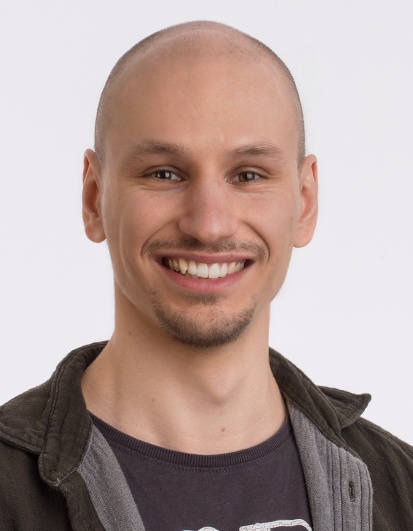

```{r knitrSetup, include=FALSE, echo = FALSE}
knitr::opts_chunk$set(warning=FALSE, message=FALSE, fig.width = 10, fig.height=5)
#knitr::read_chunk("path/to/chunks")
```


# About me

:::::: {.cols data-latex=""}

::: {.col data-latex="{0.55\textwidth}"}
```{r portrait,echo = FALSE,out.height = "175px",out.width = "137px", out.extra='style = "float: left;margin-right: 10px;margin-top: 40px;"'}

```

:::

::: {.col data-latex="{0.05\textwidth}"}
\ 
<!-- an empty Div (with a white space), serving as
a column separator -->
:::

::: {.col data-latex="{0.4\textwidth}"}

I am postdoc in the Kaleta-lab at the University Clinic Schleswig-Holstein, Kiel, Germany, and use metabolic modeling to investigate host-microbe interactions. I am try to understand how metabolic interaction within the microbiome and with the host change under changing environmental conditions and how this can be leveraged for medical applications. Before that, I tried to understand how temperature and microbes change developmental decisions in the freshwater polyp Hydra - still a hidden passion of mine.

:::
::::::


# Contact

+ Mail: [j.taubenheim@iem.uni-kiel.de](mailto:j.taubenheim@iem.uni-kiel.de)
+ Mastodon: [\@JanTaubenheim](https://mstdn.science/@JanTaubenheim)
- ORCID: [0000-0001-7283-1768](https://orcid.org/0000-0001-7283-1768)

# Vacancies

There are currently no free vacancies - however if you are interested in working with me/us please do not hesitate to get in contact. 

We are always looking for bachelor/master students and we offer [different projects](https://docs.google.com/document/d/11_YLcS413hnhSAfcMI3ouTJTWMBxgQ-ctiOiBYLEm1A/edit) but are open to new project suggestions alike. 

If you are a PhD student or a Postdoc and you want to work with us - get into contact. There is usually always a possibility to work together and find financial support, if needed.

# CV

<table>
<tbody>
  <tr>
    <td class="tg-uzvj">Since 10/2020</td>
    <td class="tg-uzvj">Research Fellow</td>
    <td class="tg-uzvj">Institute for Experimental Medicine, Medical Systems Biology, University Clinic Schleswig-Holstein, Kiel, Germany</td>
  </tr>
  <tr>
    <td class="tg-lboi">03/2019-09/2020</td>
    <td class="tg-lboi">Research Fellow</td>
    <td class="tg-lboi">Institute for Zoology and Organismic Interaction, Heinrich Heine University Düsseldorf, Germany</td>
  </tr>
  <tr>
    <td class="tg-lboi">10/2013-12/2018</td>
    <td class="tg-lboi">PhD student &amp; Research Fellow</td>
    <td class="tg-lboi">Institute for Zoology, Christian-Albrechts-University Kiel, Germany</td>
  </tr>
  <tr>
    <td class="tg-lboi">10/2011-09/2013</td>
    <td class="tg-lboi">Master Medical Biology</td>
    <td class="tg-lboi">University Duisburg-Essen, Germany</td>
  </tr>
  <tr>
    <td class="tg-cly1">10/2008-09/2011</td>
    <td class="tg-cly1">Bachelor Medical Biotechnology</td>
    <td class="tg-cly1">University Rostock, Germany</td>
  </tr>
</tbody>
</table>

## Acquired funding and academic distinctions

+ Individual Research Grant (DFG) – “Understanding Environment-Microbiome-Host metabolic interactions in Hydra” (2023)
- Young Investigator Award 2022 – CRC 1182 “Origin and function of Metaorganisms” (2022)
- Walter-Benjamin Fellowship (DFG) – but not accepted due to personal reasons (2020)

# Publications


